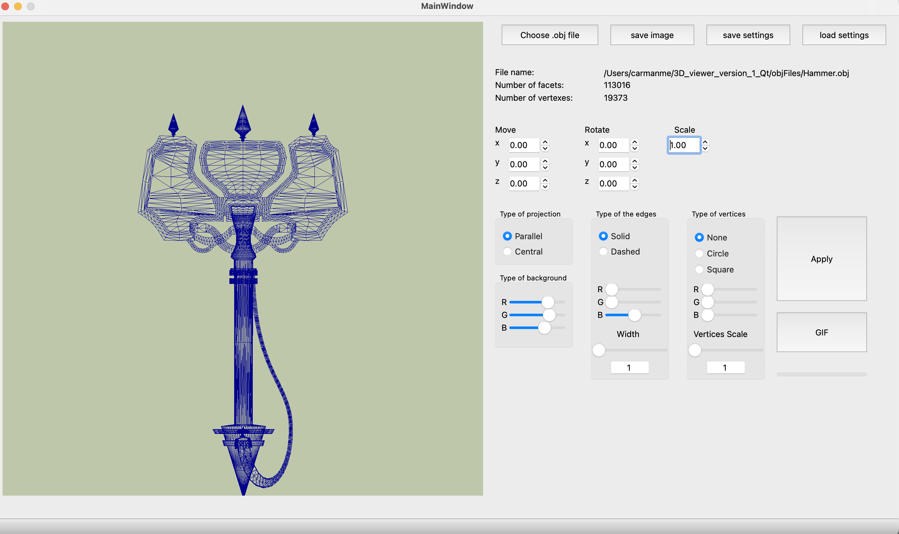

# 3DViewer v1.0

## Introduction

В данном проекте реализована на языке программирования Си и Си++ программа для просмотра 3D моделей в каркасном виде (3D Viewer). Сами модели необходимо загружать из файлов формата .obj и иметь возможность просматривать их на экране с возможностью вращения, масштабирования и перемещения.

Каркасная модель - модель объекта в трёхмерной графике, представляющая собой совокупность вершин и рёбер, которая определяет форму отображаемого многогранного объекта в трехмерном пространстве.

## Реализация 3DViewer

- Программа разработана на языке Си стандарта C11 с использованием компилятора gcc.
- Сборка программы настроена с помощью Makefile со стандартным набором целей для GNU-программ: all, install, uninstall, clean, dvi, dist, test, gcov_report.
- Программа разработана в соответствии с принципами структурного программирования
- Код придерживается Google Style
- Обеспечено покрытие unit-тестами модулей, связанных с вычислением выражений (файлы *.c), с помощью библиотеки Check
- Реализация с графическим пользовательским интерфейсом на базе GUI-библиотеки с API - Qt
- В один момент времени должна быть только одна модель на экране.
- Программа должна предоставляет возможность:
    - Загружать каркасную модель из файла формата obj (поддержка только списка вершин и поверхностей).
    - Перемещать модель на заданное расстояние относительно осей X, Y, Z.
    - Поворачивать модель на заданный угол относительно своих осей X, Y, Z
    - Масштабировать модель на заданное значение.
- Графический пользовательский интерфейс содержит:
    - Кнопку для выбора файла с моделью и поле для вывода его названия.
    - Зону визуализации каркасной модели.
    - Кнопку/кнопки и поля ввода для перемещения модели. 
    - Кнопку/кнопки и поля ввода для поворота модели. 
    - Кнопку/кнопки и поля ввода для масштабирования модели.  
    - Информацию о загруженной модели - название файла, кол-во вершин и ребер.
- Программа корректно обрабатывает и позволяет пользователю просматривать модели с деталями 1 000 000 вершин без зависания (если больше, возможно секундное ожидание).
 - Программа позволяет настраивать тип проекции (параллельная и центральная)
 - Программа позволяет настраивать тип (сплошная, пунктирная), цвет и толщину ребер, способ отображения (отсутствует, круг, квадрат), цвет и размер вершин
 - Программа позволяет выбирать цвет фона
 - Настройки сохраняются между перезапусками программы
 - Программа позволяет сохранять полученные изображения в файл в форматах bmp и jpeg
 - Программа позволяет по специальной кнопке записывать небольшие "скринкасты" - текущие пользовательские аффинные преобразования загруженного объекта в gif-анимацию

## Интерфейс и Cборка на ПК

#### Требования к ОС и ПК:

- ОС только MacOS или Linux
- Установленный qmake для сборки проекта
- При желании генерации html-страницу с покрытием модульных тестов необходим установленный lcov и gcov (brew install lcov)

#### Непосредственная сборка на ПК

- Находясь в директории 3D_viewer_version_1_Qt/ вводим в терминале make и ждем сборки примерно минуту. Открываем файл *.app в папке view
- При желании генерации html-страницу с покрытием модульных тестов вводим в терминале make gcov_report. Откроется страница в браузере с процентным покрытием строк кода
- При желании нормировании кода к Google Style вводим make linter 
- При желании проверить код на утечки памяти вводим make leaks
- При желании почитать небольшую документацию вводии make dvi

#### В целом интерфейс имеет следующий вид:

